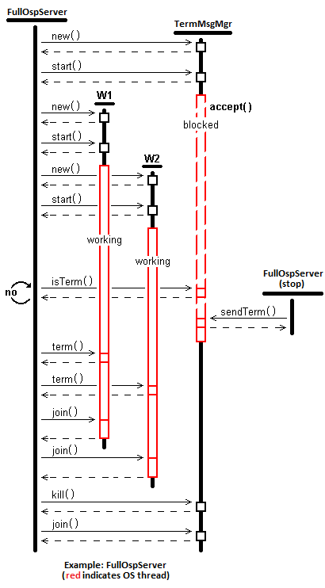

# Lightweight Command/Control [#LWComCon] 
## A Multi-Threaded, Multi-Process, Network-based</br>Command/Control Design Pattern in C++ and Java 

MIT License -- Copyright 2018 iWay Technology LLC -- Boulder, Colorado  USA
<br/>(*original work previously published under Open Source License in December, 2002*)



Multi-threading, network sockets, multiple processes ... *what's lightweight* about that?  Well, to begin with, you won't find a third-party broker stuck in the middle that you'll need to allocate machine resources for, stand-up, configure, integrate and manage.  Instead, all communications are peer-to-peer and achieved with a simple TCP network messaging model with optional acks.  My finding is that many scenarios don't need HA failover, guaranteed delivery, routing magic, etc.  Whether you're running in Kubernetes Containers or wireless routers, often - simple is better.

This repository contains materials to introduce and demonstrate a TCP network-based, Inter-process, Multi-threaded Command and Control methodology (in both C++ and Java) that's grown out of past work with **The Orderly Shutdown Design Pattern** (OSP).  Included are numerous additional utility design patterns such as -

- the C++ ThreadedWorker class which offers a simple multi-threading codification of the division of labor between creator- and created-threads and the patterns of use for startup, operation and shutdown,
- a Thread-Safe, Pointer-based Message Queue - the C++ *templatized* class ThreadSafeMsgPtrQueue - which demonstrates software *resource acquisition is initialization* (RAII) and makes trivial (literally *invisible*) the thread-safe use of Standard Template Library collections (and also defines a model for safe, responsible management of pointer-based C++ collections),
- Linux rsyslog logging techniques and utilities, and
- other utilities to ease C++ multi-threaded & network programming, testing, and trouble-shooting.

## Example C++ Use Case: Fully implemented Lightweight Command and Control App

This subdirectory project employs all the pieces above in a working example that is intended to be run from two console windows to illustrate the dynamics.  See [./c++/lwcomcon_full](./c++/lwcomcon_full).

## Example Java Use Case: The Orderly Shutdown Pattern

These Java examples are similar to the above C++ examples but they are more simple in scope (easier to follow) and don't leverage LWComCon beyond the use-case of the Orderly Shutdown Pattern.

The Orderly Shutdown Pattern (OSP), using TCP/IP-based network communications, allows a *listener thread* of a running service of arbitrary complexity to monitor for, and respond to *at a time of its own choosing*, a request to shutdown (or, quite frankly, any request).  If/when such request is received, the service will then be able to complete any critical work it has queued or initiated (at the discretion of the service) prior to any response - for example, entering a shutdown process leading ultimately to termination.

There are multiple advantages of this Pattern, first of which is that the running service can determine when *and how* to handle the request.  This may include re-enqueueing work with a message broker those tasks that have been received but are not complete. Alternatively, it may include completing those tasks prior to termination.  Any pending I/O operations can be properly flushed and closed, and any other related services can likewise be notified of its pending actions or state change.

Other advantages include offering control from remote, and multiple, sources. Specifically, how is this pattern different from Unix signal handling (eg, SIGKILL or SIGTERM)?  To begin with, this pattern allows control of the target service even if that service's host does not allow console access (less a problem in dev/test; more a problem in production -- in particular, imagine a service running within Kubernetes ...).

No access?  No problem.  Rather, network any message to the target host from any (every?) machine inside the firewall (and, by now, you're thinking *couldn't this be used for more than just* shutdown *signaling?* -- sure!).

So, with this pattern, the shutdown message *could* include any level of nuance (beyond the simple case of "Shutdown as soon as convenient" which is implemented here -- again, really *any* message symantics up to a complete control protocol).  And through the opened, two-way, socket, any acknowledgement could be returned -- even, for example, some estimate of completion time.

Some examples of more extended semantics might be 'shutdown one producer thread', or, 'add one consumer thread', etc.

Beyond those points, with this pattern, any port can be used (accommodating firewall and tunneling factors); it requires no higher-level protocol (HTTP, etc) making it *very* light weight (think *embedded* -- a single socket on a single thread vs some embedded http server dragging in an entire Python runtime environment, or, even heavier, an embedded message-bus client coupled with a middle-man broker process that must be stood up, and maintained (configured for HA, etc?).

The Orderly Shutdown Pattern pattern is extensible to SSL if desired/required (not shown here).

Finally, client-side message sends initiated from a separate process allow fast and simple integration with standard cron jobs.  Even telnet works with this design pattern.

### Elements of the OSP

The Orderly Shutdown Pattern relies upon the following basic concepts - 

- Multi-threading, or multi-processing (as desired/required)
- Socket Communication (with any message semantics)

To understand the operation and use of the OSP implementations (basic and full - see below) it is required to be familiar with the above two concepts.

#### Concepts Background and Introduction

As the ajoining diagram illustrates, the OSP wraps additional logic and processing around the above concepts, leveraging their potential.  This perhaps could make it difficult for some to modify, enhance or refactor the OSP architecture without more up-to-speed material.

Therefore, the most basic of examples of these two foundational concepts - multi-threading and sockets communication - is included herein as an introduction where desired.  Please see -

- Basic multi-threading example: [mt_basic](./mt_basic)
- Basic server-client socket communnication example: [socket_basic](./socket_basic)

### The Orderly Shutdown Pattern Implementations - Basic and Full

Two fully operational implementations are offered - basic and full.  Both of these implementations use the following devices to generically demonstrate the OSP -

- A thread sleep behavior to simulate the passage of time spent on 'real, uninterruptible work.'
- An internal counter that, should no termination message be sent, will eventually terminate the service (to illustrate the service shutdown behavior in any case).

### The OSP Basic Implementation

The Basic implementation includes these features -

- Use of a separate thread to listen for and manage termination message receipt.  This is encapsulated in a separate Class derived from Thread.
- Use of a listener socket in the service process which remains open for the duration awaiting a termination message.
- An 'uninterruptible work' loop that runs in the service, periodically checking for termination message arrival.

### The LWComCon Full Implementation

The Full implementation employs all of the elements of the Basic implementation, and adds the following - 

- Two instances of a separate threaded worker class that does the 'uninterruptible work' of the service, enabled to check for the presence of the termination condition (within process, not across the network) at appropriate times.
- An enhancement to the termination listener socket management to *fend off* poorly formed, or completely random, messages received on that socket.
- An enhancement to the termination sender logic to allow the termination message to be sent from a host other than the host on which the target service is running.  For testing, this logic still supports 'localhost' as the target of the termination message.

## Building and Running the LWComCon Examples

All the examples are command-line only -- no GUI stuff involved.  That is both intentional and practical - these are server-based concepts, not desktop-based (although they *can* be employed there).  To run some of the examples, only a single console window is required; for others, a second console window must be used (for example, to execute a stop script on a service running in another window).

All the examples have been built and tested on Ubuntu (specifically Ubuntu-server 17.10) though no features specific to that distro have been employeed.  For the Java pieces, even older JDK releases will work but testing has been done using Java 1.7 thru Java 9.

All the elements of the LWComCon repository contain working versions (mt, socket, basic, full).  There are build scripts or make files for each.  Details on installing the proper software for your environment is outside the scope of this effort but there are innumerable sources for this and I've added in below some of the install steps taken from my cmd-line history.

In brief, you will need C++ or Java development tools on your machine to run these examples.  You can download a tarfile from github, or clone the repository (preferred, and easy as pie).  As noted throughout, an MIT Open Source License has been attached to everything - it's short, direct, complete, and quite permissive, but PLEASE READ THE LICENSE (appearing below) if you are unfamiliar with its permission grants and restrictions.


Comments (and brief questions) are welcome at jt [at] iwaytechnology [dot] com.

### Supporting Software Installation Hints

This is not intended to be a tutorial on build-machine setup, but the following steps were taken to prepare an Ubuntu-server for creating these works.  Note that not all of these tools were/are required (in particular, the ubuntu-desktop), but many may have been used tangentially in the process.

#### Some Ubuntu Tools

The Ubuntu Desktop install (see below) I've found to be lightweight and quick to install because it will avoid dragging down 'office-like' software and other things superfluous for a development-only machine.  I'm not sure the gnome-terminal install is required, but there you go; Firefox I believe is absent initially; openssh-server allows you to ssh to the machine (some simple configuration is required - see the web for hints - you're looking for /etc/ssh/sshd_config ... if that file is missing, it suggests the package is not installed yet.
```
$ sudo apt-get install --no-install-recommends ubuntu-desktop
$ sudo apt-get install gnome-terminal
$ sudo apt-get install firefox
$ sudo apt-get install openssh-server 
$ sudo apt-get install git-core
```
#### C++
Many dev package installs on my machines are probably not actually used in the OSP code. Start with this and see what more you need to build and run the example code.  This should include gcc/g++, make, libs and headers.
```  
$ sudo apt-get install build-essential
```
#### Java
```
$ sudo apt-get install openjdk-8-jdk
- or -
$ sudo apt-get install oracle-java9-installer
```

**Copyright 2018 iWay Technology LLC<br/><br/>MIT License**<br/>
Permission is hereby granted, free of charge, to any person obtaining a copy of this software and associated documentation files (the "Software"), to deal in the Software without restriction, including without limitation the rights to use, copy, modify, merge, publish, distribute, sublicense, and/or sell copies of the Software, and to permit persons to whom the Software is furnished to do so, subject to the following conditions:

The above copyright notice and this permission notice shall be included in all copies or substantial portions of the Software.

THE SOFTWARE IS PROVIDED "AS IS", WITHOUT WARRANTY OF ANY KIND, EXPRESS OR IMPLIED, INCLUDING BUT NOT LIMITED TO THE WARRANTIES OF MERCHANTABILITY, FITNESS FOR A PARTICULAR PURPOSE AND NONINFRINGEMENT. IN NO EVENT SHALL THE AUTHORS OR COPYRIGHT HOLDERS BE LIABLE FOR ANY CLAIM, DAMAGES OR OTHER LIABILITY, WHETHER IN AN ACTION OF CONTRACT, TORT OR OTHERWISE, ARISING FROM, OUT OF OR IN CONNECTION WITH THE SOFTWARE OR THE USE OR OTHER DEALINGS IN THE SOFTWARE.
